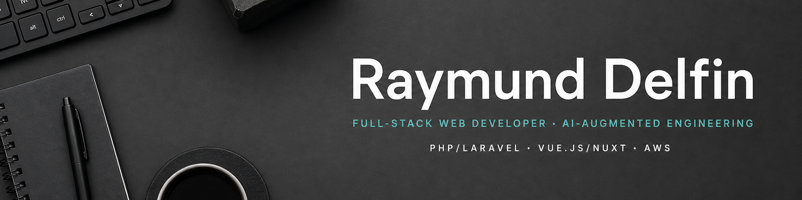

# Raymund Delfin

**Full-Stack Web Developer · AI-Augmented Engineering**

`PHP/Laravel` · `Vue.js/Nuxt` · `AWS`

## I build reliable systems and ship useful products.

I have 20+ years of experience building scalable web applications, REST APIs, cloud systems, and digital products. I work across the full delivery lifecycle—from architecture and backend services to frontend implementation, deployment, production support, and continuous product improvement.

[Selected work](#selected-product-work) · [Open source](#open-source) · [Recognition](#recognition) · [LinkedIn](https://www.linkedin.com/in/rcdelfin/)

---

## Core expertise

**Backend and APIs** — `PHP` · `Laravel` · `WordPress` · `REST APIs` · `Queues` · `Integrations`

**Frontend** — `Vue.js` · `Nuxt` · `JavaScript` · `TypeScript` · `PrimeVue` · `React`

**Cloud and data** — `AWS` · `Docker` · `Linux` · `CI/CD` · `Redis` · `MySQL` · `PostgreSQL` · `MongoDB`

**Engineering** — `System design` · `Testing` · `Code review` · `Mentoring` · `Agile` · `AI-augmented workflows`

---

## Selected product work

### GymEd

A fitness platform for therapists and clients, combining client management, an exercise library, program building, session logging, and progress dashboards.

[Web app](https://app.gymed.com.au/) · [Website](https://www.gymed.com.au/)

**Backend/API Developer**

`PHP` · `Laravel`

### [MoveWithUs™](https://movewithus.com/)

A fitness platform with workout, nutrition, subscription, and community features.

`Laravel` · `Vue.js` · `AWS`

### [Appetiser Baseplate](https://baseplate.appetiserdev.tech/)

A reusable application foundation designed to accelerate consistent delivery across web products.

`Laravel` · `Nuxt` · `AWS`

### [FitMe](https://fitme.tv/)

A fitness platform supporting personalised programs, progress tracking, and user engagement.

`Laravel` · `AWS`

### [Allied Health AU](https://www.alliedhealthau.com/)

Full-stack developer on an allied health platform supporting appointments and telehealth services.

`Laravel` · `Nuxt` · `AWS`

### [Troly WooCommerce Extension](https://www.linkedin.com/showcase/troly-ioabc/about/)

Web and WordPress plugin developer on a B2B platform supporting wineries, direct sales, e-commerce, and operational workflows.

`WordPress` · `WooCommerce` · `API integration`

---

## Open source

### [Nuxt API Query](https://github.com/rcdelfin/nuxt-api-query)

A fluent API query builder inspired by Eloquent-style developer ergonomics.

`TypeScript` · `Nuxt 3`

### [Slack Status Updater](https://github.com/rcdelfin/slack-status-updater)

Automation for managing Slack status across work hours, breaks, holidays, and multiple workspaces.

`Bun.js` · `TypeScript` · `Docker`

---

## Recognition

### [Grand Winner, 1st AngelHack Manila 2013](https://www.rappler.com/technology/31449-angelhack-manila-battle-silicon-valley/)

I was part of Team PageSnapp, which won the inaugural AngelHack Manila and represented the Philippines at AngelHack Global Demo Day in Silicon Valley.

---

## Outside work

I enjoy learning new technologies, sharing knowledge, exploring history and culture, playing video games, watching anime, walking, and gardening.
